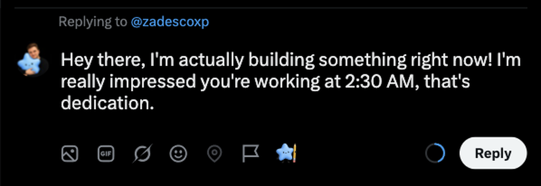
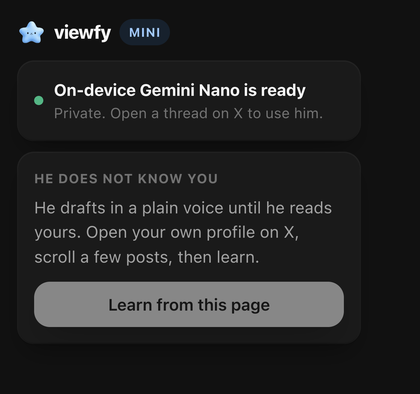

# Viewfy Mini

Reads your X account, understands the page you're on and drafts messages in
your voice with an on-device LLM. No account, no server, no API key. Nothing
leaves the browser.

The model is Gemini Nano, the one built into Chrome, reached through the Prompt
API. Every prompt, every post it reads and every draft it writes stays on your
machine. He learns how you sound from your own posts, on an explicit button
press, and never reads anything in the background.

He drafts. You edit in place and press Post yourself. Nothing is ever sent for
you.

Mini drafts where you already are. The [full Viewfy](https://viewfy.ai/chrome)
finds the threads where your buyers are asking and queues the drafts for your
approval.

## Run it

Chrome 138 or newer, desktop. `chrome://extensions`, Developer mode, Load
unpacked, pick this folder. The first popup fetches the model once for the
whole browser.

X only for now. Replies, the reply modal and the home composer.

## License

[Apache 2.0](LICENSE). The code is yours to fork. The Viewfy name and the
mascot art under `assets/` are brand assets and are not part of the grant,
see [NOTICE](NOTICE).
